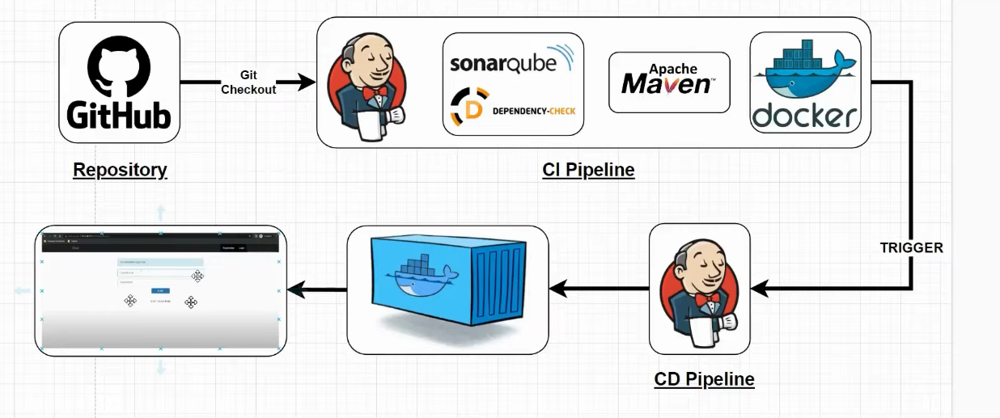
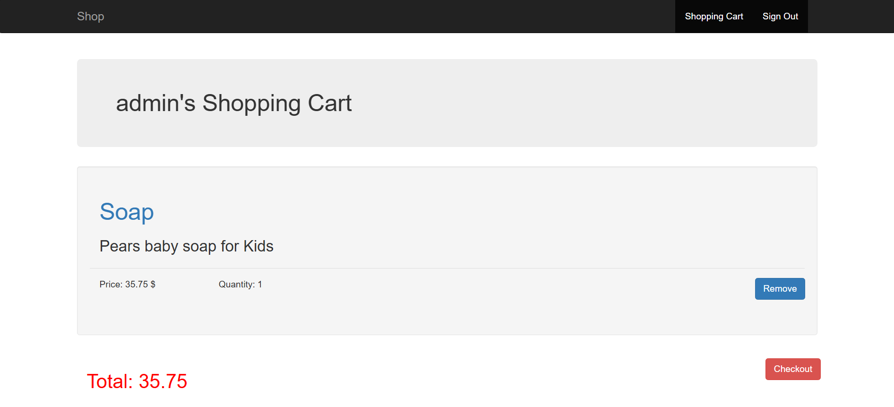
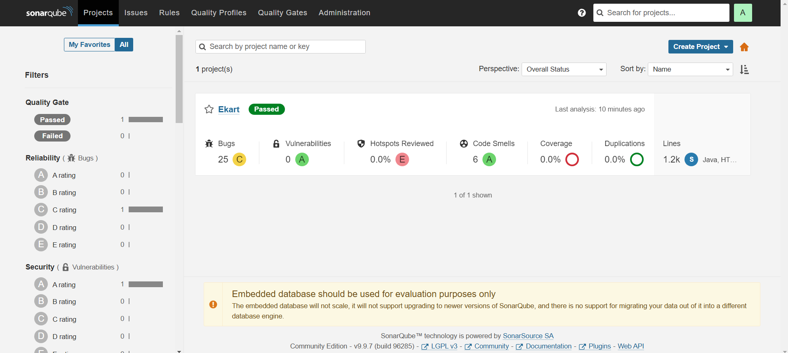
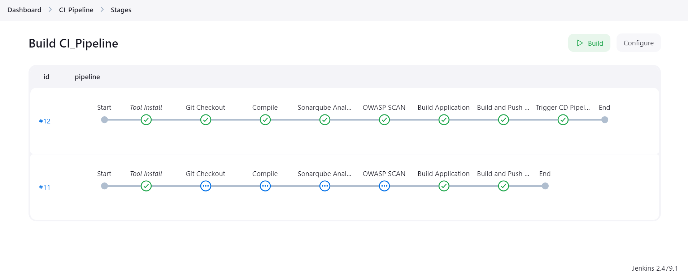

# CI_Pipeline



## Pipeline Configuration

### 1. Discard Old Builds

- **Max number of builds to keep**: 2  
  This ensures that only the latest two builds are kept in Jenkins, helping to save storage and keep the build history manageable.

### 2. Required Plugins

These plugins are necessary for the pipeline to function correctly:

- **Eclipse Temurin Installer**: Installs the OpenJDK.
- **SonarQube Scanner**: Allows Jenkins to communicate with SonarQube for static code analysis.
- **OWASP Dependency Check**: Scans for vulnerabilities in dependencies.
- **Docker**: Allows building and pushing Docker images.
- **Docker Pipeline**: Extends the Jenkins pipeline with Docker-specific steps.
- **CloudBees Docker Build and Publish**: Helps with Docker image building and pushing to repositories.

### 3. Tools Configuration

Configure the following tools:

- **JDK 17 (Temurin)**: Install OpenJDK from adoptium.net.
- **Maven 3.6.0**: Used to compile and build Java applications.
- **Sonar-Scanner**: Latest version for integrating SonarQube analysis.
- **OWASP Dependency Check (DP version 6.5.1)**: Scans for vulnerabilities.
- **Docker**: Latest version downloaded from docker.com.

### 4. Pipeline Environment

Set environment variable for SonarQube scanner:

```groovy
environment {
  SCANNER_HOME = tool 'sonar-scanner'
}
```

## Overview

The `CI_Pipeline` is a Jenkins pipeline designed to automate the build and testing processes for the **Ekart** project. This pipeline ensures code is properly checked out, compiled, analyzed for quality, built into a Docker image, and pushed to a Docker registry. Additionally, it triggers the Continuous Deployment (CD) pipeline to deploy the image to a container.

## Pipeline Stages

### 1. **Git Checkout**

- **Purpose**: Clone the project repository.
- **Details**:  
  The pipeline checks out the code from the GitHub repository to the Jenkins workspace:
  ```groovy
  git branch: 'main', changelog: false, poll: false, url: 'https://github.com/<username>/Ekart.git'
  ```

### 2. **Compile**

- **Purpose**: Compile the project using Maven.
- **Details**:  
  The `mvn clean compile` command is used to clean any previous build artifacts and compile the project:
  ```groovy
  sh "mvn clean compile"
  ```

### 3. **SonarQube Analysis**

- **Purpose**: Perform static code analysis to ensure code quality.
- **Details**:  
  The SonarQube scanner is used to analyze the project’s code quality. The analysis results are sent to a SonarQube server for review:
  ```groovy
  sh '''
     ${SCANNER_HOME}/bin/sonar-scanner -Dsonar.host.url=http://<sonarqube-ip-address>:9000/ \
     -Dsonar.login=<sonarqube-token> \
     -Dsonar.projectName=Ekart -Dsonar.java.binaries=. -Dsonar.projectKey=Ekart
  '''
  ```

### 4. **OWASP Dependency Check**

- **Purpose**: Perform a security scan to detect vulnerabilities in dependencies.
- **Details**:  
  This stage uses the OWASP Dependency-Check plugin to scan for security vulnerabilities in project dependencies:
  ```groovy
  dependencyCheck additionalArguments: ' --scan ./', odcInstallation: 'DP'
  dependencyCheckPublisher pattern: ' **/dependency-check-report.xml'
  ```

### 5. **Build Application**

- **Purpose**: Build the application with Maven, skipping the tests.
- **Details**:  
  The `mvn clean install -DskipTests` command builds the project while skipping tests to speed up the build process:
  ```groovy
  sh "mvn clean install -DskipTests"
  ```

### 6. **Build and Push Docker Image**

- **Purpose**: Build a Docker image and push it to a Docker registry.
- **Details**:  
  This stage builds the Docker image using the `Dockerfile` and pushes it to Docker Hub:
  ```groovy
  withDockerRegistry(credentialsId: '9db0f22a-fe75-412e-8287-f1c5d5857ad4', toolName: 'docker') {
      sh "docker build -t ekart:latest -f docker/Dockerfile ."
      sh "docker tag ekart:latest fasih6/ekart:latest"
      sh "docker push fasih6/ekart:latest"
  }
  ```

### 7. **Trigger CD Pipeline**

- **Purpose**: Trigger the Continuous Deployment pipeline to deploy the Docker image.
- **Details**:  
  This stage triggers the `CD_Pipeline` to deploy the Docker image:
  ```groovy
  build job: "CD_Pipeline", wait: true
  ```

---

## Conclusion

The `CI_Pipeline` ensures a streamlined process for building, testing, and deploying the **Ekart** project. It performs code quality checks, compiles the project, scans for security vulnerabilities, builds a Docker image, and pushes it to a Docker registry. Afterward, it triggers the deployment process in the CD pipeline.

---

Ekart App


Sonarqube Dashboard


jenkins dashboard

